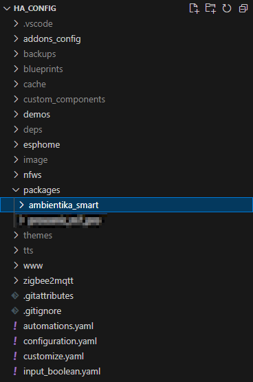
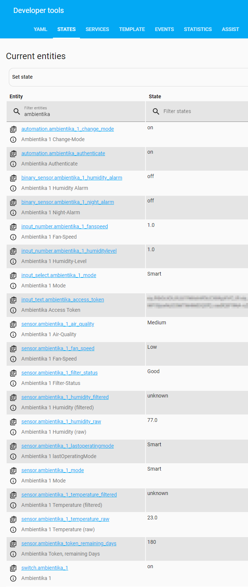
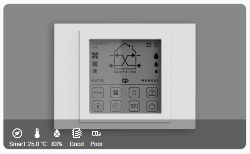
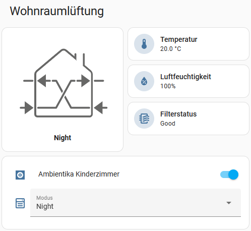
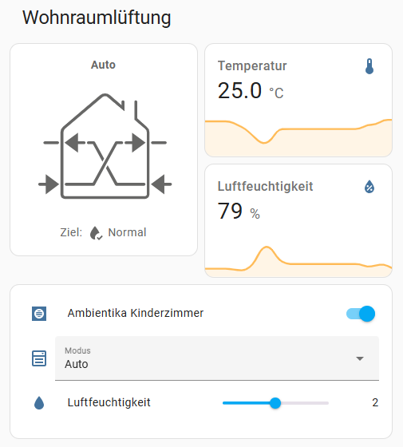
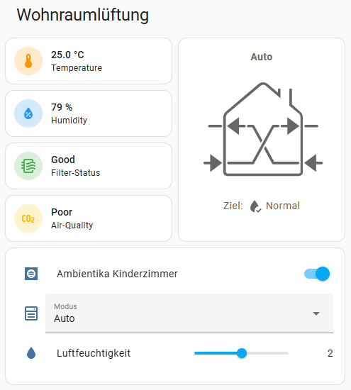

# Home Assistant Package for **Südwind Ambientika smart**

This package provides multiple config files that will create REST sensors, (REST) scripts, automations, and other config entities for using the [Südwind Ambientika smart](https://www.ambientika.eu/en/ambientika-smart/sw10035) within [Home Assistant](https://www.home-assistant.io/).
Since I haven't found any smart *single-room heat recovery ventilation system* within the EU that fits all my requirements, I decided to take matters into my own hands. I purchased the Südwind Ambientika smart and started to reverse-engineer the REST API used to remotely control the unit using the [Android App](https://play.google.com/store/apps/details?id=sw.ambientika.app). For those who are interested in my **requirements**: 
- thin wall thickness (max. 25 cm)
- high heat recovery rate (min. 88%)
- smart/remote-controlled (ideally: Home Assistant Integration)

If you are interested in the **reverse-engineering process** see the corresponding [documentation](reverse_engineering.md) for reference.


## Installation and Setup
> [!NOTE]  
> _This package is delivered "as-is" → do not expect to get support in this repository!_  
> _However, if you find technical problems with this package (e.g., server changes, compatibility issues, YAML syntax changes, etc.), feel free to open an issue. Or even better: fix the issue and submit a pull request. The same applies to feature requests and enhancements._  

> [!IMPORTANT]  
> This setup assumes that you have an account registered in the official app and that **your Ambientika Device is already working** via the official App.

### 1. Download and extract the package to the config folder
Download the repository from GitHub as ZIP-file, extract it and place it in the correct folder:
`/config/packages/ambientika_smart`
<details>
  <summary>Screenshot</summary>  
  
</details>
<br>

> [!NOTE]  
> If you want to use my example approaches for the Lovelace UI, the images must be copied to `/config/www/ambientika_smart/`


### 2. Setting up `configuration.yaml`: 
Add the `homeassistant:`, `package:` and `ambientika_smart:` lines to your configuration.yaml as shown in my example here:
``````
homeassistant:
  packages:
    ambientika_smart_0: !include packages/ambientika_smart/0_general.yaml
    ambientika_smart_1: !include packages/ambientika_smart/1_master.yaml
    ambientika_smart_2: !include packages/ambientika_smart/2_slave.yaml
    ...
``````
> [!WARNING]  
> Never delete or edit the `ambientika_smart_0:` or `0_general.yaml`. It provides some general mandatory stuff for this package. If deleted, the package will not work!  

> [!NOTE]  
> For each device you want to integrate you need a line with `ambientika_smart_x` _(where **x** represents any number)_. 
> You can rename the *.yaml as you like, but make sure to pick the right one depending on your device role (Master/Slave).


### 3. Setting up `secrets.yaml`:
First, navigate to the `packages/ambientika_smart/` folder and
1. Rename the `secrets_example.yaml` → `secrets.yaml`.
2. Then edit the lines shown here. **The device serial is equivalent to the MAC address of your device**. Typically, you can see and copy the MAC-address from your router.
``````
ambientika_username: "example@yahoo.com"
ambientika_password: "my-secret-password"

ambientika_device_serial_1: 1234567890ABC
ambientika_device_serial_1: 4567890ABCDEF

ambientika_device_status_1: https://app.ambientika.eu:4521/device/device-status?deviceSerialNumber=1234567890ABC
ambientika_device_status_1: https://app.ambientika.eu:4521/device/device-status?deviceSerialNumber=4567890ABCDEF
``````
> [!NOTE]  
> Same here: For each device you need a line with `ambientika_device_serial_x` and a line with `ambientika_device_status_x` and fill them with the corresponding serial-number.


### 4. Setting up `*master.yaml` and `*slave.yaml`:
<details>
<summary>For details about <b>Master-Slave role and operation</b> open here.</summary> 

Basically there is a single master device, which you can control. For that device you can define the operation mode, fan-speed, humidity target-level and light-level. This device then connects to its assigned slaves and controls their behavior. This means the devices are joining forces in **Push-Pull operations**, where:
- one or more device blows out used air (exhaust air phase) 
- one or more opposite device draws in fresh air (supply air phase)

After 60-90 seconds, the devices are changing directions. The master coordinates this change to ensure balanced air circulation. The Ambientika ventilation system also has **ceramic heat exchangers for heat recovery**. During the exhaust air phase, the heat exchanger stores the heat energy, which is then transferred to the incoming fresh air in the subsequent supply air phase.  

If you use an operation-mode where sensor values are taken into account (Smart, Auto, AwayHome and Surveillance) the values from the master are used to do decisions. So it might be useful to set the device in the most challenging environment to be the master.


</details> 
<br>

Now you need to set up a configuration files for each device. They are separated based on the device role. 

<br>


### 5. Restart Home Assistant
1. Go to "**Developer tools**" first and click on "**CHECK CONFIGURATION**" before restarting!
   - If you have any configuration issues, Home Assistant might restart into "**Recovery Mode**"! You don't want that.
   - If an error is displayed, read the message carefully and follow the instructions!
2. Then: Click on "**RESTART**" > "**Restart Home Assistant**" (Do not use _Quick Reload_) and proceed with "**OK**".


### 6. Check if the package is working
Once Home Assistant is restarted, the `automation.ambientika_authenticate` automation will be triggered and obtain the access token automatically. The token will be stored in the `input_text.ambientika_access_token` entity (type: `password`), which by default is excluded from the recorder to protect writing sensitive information into the persistent database. In addition, the token is automatically renewed as soon as the previous token is valid for less than 5 days.

You can check the incoming values in the "**Developer tools**" > "**STATES**" and filter for "**Ambientika**".
<details>
  <summary>See more Details</summary>  


> The sensors "**Ambientika 1 Humidity (filtered)**" and "**Ambientika 1 Temperature (filtered)**" are producing a `unknown` value, for the first 5-15 minutes. Afterwards they should return smooth values ([see the Documentation for Details](reverse_engineering.md#filter-values)). If not, you might check the `entity_id` for both sensors to ensure that they are connected to the correct raw valued sensor.
</details>  


<!---
### 7. Adapt names, if necessary
The idea here is: I would use numbering for entity names and IDs to reduce the amount of editing. But in the user interface, I would use descriptive terms such as "Ambientika Bedroom" for better understanding and for Voice Assistants. Therefore, only the `friendly_name`/`name`/`alias` section will be adapted in this List:
- `switch.yaml`:
   - ``friendly_name``: Ambientika 1
- `helpers.yaml`: 
   - ``name``: Ambientika 1 Fan-Speed
   - ``name``: Ambientika 1 Humidity-Level
   - ``name``: Ambientika 1 Mode
- `automation.yaml`:
   - ``alias``: Ambientika 1 Change-Mode
- `sensors.yaml`:
   - ``name``: Ambientika 1 Current Mode
   - ``name``: Ambientika 1 lastOperatingMode
   - ``name``: Ambientika 1 Fan-Speed
   - ``name``: Ambientika 1 Filter-Status
   - ``name``: Ambientika 1 Temperature (raw)
   - ``name``: Ambientika 1 Humidity (raw)
   - ``name``: Ambientika 1 Air-Quality
   - ``name``: Ambientika 1 Humidity Alarm
   - ``name``: Ambientika 1 Night-Alarm
   - ``name``: Ambientika 1 Humidity (filtered)
   - ``name``: Ambientika 1 Temperature (filtered)  


### 8. Duplicate to "Ambientika 2" if you have multiple Master-devices
> [!NOTE]  
> The current approach is subject to change. See [#11](https://github.com/Flo-R1der/ambientika-smart_4_home-assistant/issues/11) for details.

In case you have multiple devices set as **Master** you need to copy all the yaml-code assigned with id/name "Ambientika 1" and duplicate it to "Ambientika 2" for example. On Windows machines you might use `CTRL + H` to start the mass replacement and:
- find: ``_1`` (most entities) / ``-1`` (secrets) *
- replace: ``_2`` / ``-2``

> [!WARNING]  
> \* don't use only `1` in the "find" field as it will also change values for fan speed or port-number for the REST-API which will break your package!

This needs to be done for:
- ``automation.yaml`` (here, a `variables:`-section is already implemented for simplification )
- ``customize.yaml``
- ``helpers.yaml``
- ``secrets.yaml``
- ``sensors.yaml``
- ``switch.yaml``

Repeat this step, if you have even more Master devices.


### 9. Maintenance

some filter reset information.

-->

-----

## User Interface
I have also created some UI examples, which are provided in the table below.  
Please note that the SVG images included in this package are originally from the Android app. In case new images are added in the future, feel free to use the [description of picture extraction](reverse_engineering.md#getting-the-images-for-the-ui) in my reverse-engineering description to update the package accordingly.

> [!NOTE]  
> If you want to use my example approaches for the Lovelace UI, the images must be copied to `/config/www/ambientika_smart/` first!


### Examples  
| Image | YAML-code |
| ----- | --------- |
|  | [lovelace.yaml_example-0](lovelace.yaml_example-0) |
|  | [lovelace.yaml_example-1](lovelace.yaml_example-1) |
|  | [lovelace.yaml_example-2](lovelace.yaml_example-2) |
|  | [lovelace.yaml_example-3](lovelace.yaml_example-3) * |

\* This approach takes advantage of the [Mushroom Template Card](https://github.com/piitaya/lovelace-mushroom/blob/main/docs/cards/template.md). In order to use it you must install the Mushroom cards first. I would recommend to use [HACS](https://hacs.xyz/) to install them.


## Open Topics
- I am not able to provide a custom integration. However, others managed to do so. You can find the official Integration on Github: **[ambientika](https://github.com/ambientika) / [HomeAssistant-integration-for-Ambientika](https://github.com/ambientika/HomeAssistant-integration-for-Ambientika)** and on [HACS](https://www.hacs.xyz/).
- This package and the official integration is depending on the cloud with all advantages and disadvantages. If you like to get a local control of your device, you might check this repository: [sragas / ambientika-local-control](https://github.com/sragas/ambientika-local-control). But the documentation is not on the desired level which makes this a more advanced and sophisticated approach.
- A [Template-Fan](https://www.home-assistant.io/integrations/fan.template/) may be a thing. But I'm not sure, if this makes any sense with this device.

<br>

## Like my work?  
[](https://ko-fi.com/I3I4160K4Y)
