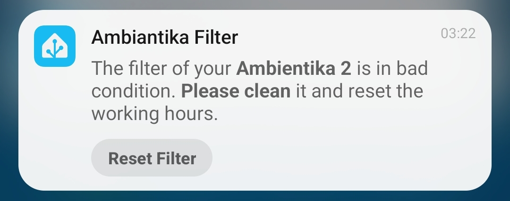
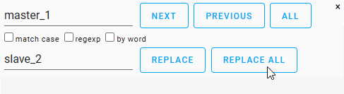

# Home Assistant Package for **Südwind Ambientika smart**

This package provides multiple config files that will create REST sensors, (REST) scripts, automations, and other config entities for using the [Südwind Ambientika smart](https://www.ambientika.eu/en/ambientika-smart/sw10035) within [Home Assistant](https://www.home-assistant.io/).
Since I haven't found any smart *single-room heat recovery ventilation system* within the EU that fits all my requirements, I decided to take matters into my own hands. I purchased the Südwind Ambientika smart and started to reverse-engineer the REST API used to remotely control the unit using the [Android App](https://play.google.com/store/apps/details?id=sw.ambientika.app). For those who are interested in my **requirements**: 
- thin wall thickness (max. 25 cm)
- high heat recovery rate (min. 88%)
- smart/remote-controlled (ideally: Home Assistant Integration)

If you are interested in the **reverse-engineering process** see the corresponding [documentation](reverse_engineering.md) for reference.


## Installation and Setup
> [!NOTE]  
> _This package is delivered "as-is" → do not expect to get support in this repository!_  
> _However, if you find technical problems with this package (e.g., server changes, compatibility issues, YAML syntax changes, etc.), feel free to open an issue. Or even better: fix the issue and submit a pull request. The same applies to feature requests and enhancements._  

> [!IMPORTANT]  
> This setup assumes that you have an account registered in the official app and that **your Ambientika Device is already working** via the official App.

> [!CAUTION]  
> **There are breaking changes in v0.2.0 that you need to be aware of when updating. You can ignore this warning if you haven't used a previous version. Details see [changelog](CHANGELOG.md).**


### TL;DR
1. Download and extract the package to `/config/packages/ambientika_smart`
2. Configure ``packages:`` in your  `configuration.yaml` and define the required secrets in your `secrets.yaml`
3. Set up `*_master.yaml` and `*_slave.yaml` in the package and restart Home Assistant.
4. Verify that everything works and adjust `friendly_name`/`alias`/`name` as needed.
5. Please consider the [Filter Notification and Reset: ToDo](#todo) and the [Open Topics](#open-topics)


### 1. Download and extract the package to the config folder
Download the repository from GitHub as ZIP-file, extract it and place it in the correct folder:
`/config/packages/ambientika_smart`
<details>
  <summary>Screenshot</summary>  
  
</details>
<br>

> [!NOTE]  
> If you want to use my example approaches for the Lovelace UI, the images must be copied to `/config/www/ambientika_smart/`


### 2. Setting up `configuration.yaml`: 
Add the `homeassistant:`, `package:` and `ambientika_smart:` lines to your `configuration.yaml` as shown in my example here:
``````
homeassistant:
  packages:
    ambientika_smart_0: !include packages/ambientika_smart/0_general.yaml
    ambientika_smart_1: !include packages/ambientika_smart/1_master.yaml
    ambientika_smart_2: !include packages/ambientika_smart/2_slave.yaml
    ...
``````
> [!WARNING]  
> **The `ambientika_smart_0:` or `0_general.yaml` file contains essential components required for this package to function. Do not delete it, or the package will stop working!**

> [!NOTE]  
> For each device you want to integrate, add a line with `ambientika_smart_x` _(where **x** is any number)_. 
> Ensure that the device role (Master/Slave) matches the corresponding ``*_master.yaml`` or ``*_slave.yaml`` file.


### 3. Setting up `secrets.yaml`:
First, navigate to the `packages/ambientika_smart/` folder and
1. Rename the `secrets_example.yaml` → `secrets.yaml`.
2. Then edit the lines shown here. **The device serial is equivalent to the MAC address of your device**. Typically, you can see and copy the MAC-address from your router.
``````
ambientika_username: "example@yahoo.com"
ambientika_password: "my-secret-password"

ambientika_device_serial_1: 1234567890ABC
ambientika_device_serial_1: 4567890ABCDEF

ambientika_device_status_1: https://app.ambientika.eu:4521/device/device-status?deviceSerialNumber=1234567890ABC
ambientika_device_status_1: https://app.ambientika.eu:4521/device/device-status?deviceSerialNumber=4567890ABCDEF
``````
> [!NOTE]  
> Same here: For each device you need a line with `ambientika_device_serial_x` and a line with `ambientika_device_status_x` and fill them with the corresponding serial-number.


### 4. Setting up `*_master.yaml` and `*_slave.yaml`:
<details>
<summary>Click here for details about <b>Master-Slave roles and operation</b>.</summary> 

> Typically, there's a single master device that you can control. For this device, you can define the operation mode, fan speed, target humidity level, and light level.
The master connects to its assigned slaves and controls their behavior. Together, they operate in **push-pull mode**, meaning:
> - One or more devices expel used air (exhaust phase)
> - One or more opposite devices draw in fresh air (supply phase)
> 
> Every 60–90 seconds, the devices switch direction. The master coordinates this to ensure balanced air circulation.
The Ambientika ventilation system also features **ceramic heat exchangers for heat recovery**. During the exhaust phase, heat is stored in the exchanger and then transferred to the fresh air during the supply phase.
> 
> If you're using an operation mode that considers sensor values (e.g. Smart, Auto, AwayHome, or Surveillance), the master device’s values are used for decision-making. It’s often best to choose the device in the most demanding environment as the master.
> 
> 
</details> 

Now you need to set up a configuration file for each device, depending on its role:
- **`0_general.yaml`** contains essential definitions such as REST commands, authentication, and filter notification/reset automation. **WARNING**: Do not delete this file — it is mandatory! 
- **`1_master.yaml`** includes everything required for a master device: sensors, input entities, on/off switch, and automation for mode changes.
- **`2_slave.yaml`** includes only sensors, as slave devices cannot be directly controlled by the user.

**You can use these files as-is if they meet your needs**.
If not and you have multiple devices that are not covered with the existing files, follow these steps **for each device you want to integrate in your Home Assistant**:
1. **Add the device's secrets** to your `secrets.yaml` (/config/packages/ambientika_smart/) as described in step 3. Without this, sensors will remain 'unavailable' or 'unknown'.
2. **Duplicate** the master or slave YAML file and give it an appropriate name.
3. **Replace all occurrences** of `master_1` or `slave_2` in the copied file (e.g. with `CTRL + H`). Use a matching name and number based on your new filename.
4. **Update the secrets** by replacing all `!secrets: ambientika_device_serial_x` and `!secrets: ambientika_device_status_x` with the corresponding entries from your ``secrets.yaml``.
5. **For slave devices only**: In the `homeassistant: customize:` section of your `*_slave.yaml` set the `related_master` entity_id to ensure proper display of the operating mode. (See issue #24 for more info.)
6. **Register the new file** in your `configuration.yaml` (/config) as described in Step 2. Without this, the file won’t load at startup.

> [!WARNING]  
> Do not rename the `friendly_name`/`name`/`alias` at this stage. These values define the entity_id. Changing them now can break dependencies.  
> Wait until after the initial restart of Home Assistant with this package, and follow the instructions in [7. Adapt names, if necessary](#7-adapt-names-if-necessary)


### 5. Restart Home Assistant
1. Go to "**Developer tools**", Tab "**YAML**" first and click on "**CHECK CONFIGURATION**" before restarting!
   - If you have any configuration issues, Home Assistant might restart into "**Recovery Mode**"! You don't want that.
   - If an error is displayed, read the message carefully and follow the instructions!
2. Then: Click on "**RESTART**", "**Restart Home Assistant**" (Do not use _Quick Reload_) and proceed with "**OK**".


### 6. Check if the package is working
Once Home Assistant is restarted, the `automation.ambientika_authenticate` automation will be triggered and obtain the access token automatically. The token will be stored in the `input_text.ambientika_access_token` entity (type: `password`), which by default is excluded from the recorder to protect writing sensitive information into the persistent database. In addition, the token is automatically renewed as soon as the previous token is valid for less than 5 days.

You can check the incoming values in the "**Developer tools**", Tab "**STATES**" and filter for "**Ambientika**".
<details>
  <summary>See more Details</summary>  


> The sensors "**Ambientika 1 Humidity (filtered)**" and "**Ambientika 1 Temperature (filtered)**" are producing a `unknown` value, for the first 5-15 minutes. Afterwards they should return smooth values ([see the Documentation for Details](reverse_engineering.md#filter-values)). If not, you might check the `entity_id` for both sensors to ensure that they are connected to the correct raw valued sensor.
</details>  


### 7. Adapt names, if necessary
> [!WARNING]  
> Do not rename the `friendly_name`/`name`/`alias` before the initial restart of Home Assistant with this package!

The idea is to use numbered names and device roles (e.g. ``Master-1``, ``Slave-2``) for entity names and IDs to keep editing minimal. However, in the user interface, it's better to use descriptive names like “Ambientika Bedroom” — especially for clarity and voice assistant integration.
To update display names only (without breaking internal references), you can adjust the `friendly_name`/`name`/`alias` fields using a mass-replace:
- **Replace** all occurrences of `Master-1` or `Slave-2` in the YAML files by pressing `CTRL + H`, choose a meaningful name (e.g. Bedroom, Childroom, Bathroom, Kitchen, etc.) and select **replace all**.
- Repeat his step for all master and slave YAML files - but **do not edit the `0_general.yaml`** at this point!


### 9. Filter Notification and Reset
The only maintenance required for the device is to clean the filter from time to time. Internally, the device appears to track operating hours and reports the filter status as "Good", "Medium" or "Bad".  
In `0_general.yaml` there's a **[Filter Notification and Reset Automation](0_general.yaml#L83)** that triggers when either `sensor.ambientika_master_1_filter_status` or `sensor.ambientika_slave_2_filter_status` changes to "Bad". This automation sends a **sticky notification** to all mobile devices connected to Home Assistant:



Once you've cleaned the filter, you should be able to reset the operating hours by pressing the **Reset Filter** button on your mobile device (requires an active connection to your Home Assistant instance). The reset command is sent to the control server, and the filter status _should_ switch back to "Good".  
> But why do I write "_should_ reset" instead of "will reset"? ► See [Open Topics](#open-topics); that's why.

#### ToDo
If you want to enable filter notifications and reset functionality for other devices (not just ``master_1`` or ``slave_2``), you have **two options**:
- In the [0_general.yaml on Line 88](0_general.yaml#L88) update the list of **filter status sensors**.  
  Then go to **Developer tools** → **YAML** tab, and click **CHECK CONFIGURATION**. If everything is fine, click on **AUTOMATIONS** to reload the automations. Double-check the automation afterward.
- Alternatively, open the automation editor for **Ambientika Filter Notification** and click on **MIGRATE**.  
  This creates a UI-editable copy of the automation. Add the desired filter status sensors to the state trigger.  
  ⚠️ Afterwards, make sure to **disable the original YAML-based automation** from the package!

<br>

-----

## User Interface
I have also created some UI examples, which are provided in the table below.  
Please note that the SVG images included in this package are originally from the Android app. In case new images are added in the future, feel free to use the [description of picture extraction](reverse_engineering.md#getting-the-images-for-the-ui) in my reverse-engineering description to update the package accordingly.

> [!NOTE]  
> If you want to use my example approaches for the Lovelace UI, the images must be copied to `/config/www/ambientika_smart/` first!


### Examples  
The examples from the table below are working for the device ``master_1``. For all other devices you must replace:
- All ``master_1`` → ``slave_2`` or whatever renaming you have done in [4. Setting up master and slave](#4-setting-up-_masteryaml-and-_slaveyaml).  

In the Home Assistant editor the replacing function can be started be pressing `CTRL + F` on your keyboard: <br>


| Image | YAML-code |
| ----- | --------- |
|  | [lovelace.yaml_example-0](lovelace.yaml_example-0) |
|  | [lovelace.yaml_example-1](lovelace.yaml_example-1) <sup>(1)</sup> |
|  | [lovelace.yaml_example-2](lovelace.yaml_example-2) <sup>(1)</sup> |
|  | [lovelace.yaml_example-3](lovelace.yaml_example-3) <sup>(1,2)</sup> |

<sup>(1)</sup> To use this card for a slave-device, remove the second part of the vertical stack. It would show failures anyway as there are no control entities for a slave-device.  
<sup>(2)</sup> This approach takes advantage of the [Mushroom Template Card](https://github.com/piitaya/lovelace-mushroom/blob/main/docs/cards/template.md). In order to use it you must install the Mushroom cards first. I would recommend to use [HACS](https://hacs.xyz/) to install them.

<br>


## Open Topics
- Unfortunately the [Ambientika API](https://app.ambientika.eu:4521/swagger/index.html) is acting strange on some things:
   1. For slave devices: A not actual operation-mode is received from the API. The received value equals to the last set operation-mode when this device was a master (from the device onboarding, since devices will always be onboarded as master). Patch provided with #24, but I'm still not happy solving the problem on the endpoint.
   2. The filter reset does not work with other filter conditions rather than "Bad". This disables the possibility to reset the operating hours if you clean it more often. Big dislike, since I used to clean them all in one go and reset the operating hours fol all if possible.
   3. The filter rest does not work on slave devices. The filter condition on the slave is calculated independent from the master (as all sensor values). And even tho the condition is shown as "Bad", the API call is sent and the answer is 200 (success), the filter remains in "Bad" state.
   4. When I look at No 3. and 4. it may also be, that the filter reset is broken in general... (Date: 2025-03-16)
- I am not able to provide a custom integration. However, others managed to do so. You can find the official Integration on Github: **[ambientika](https://github.com/ambientika) / [HomeAssistant-integration-for-Ambientika](https://github.com/ambientika/HomeAssistant-integration-for-Ambientika)** and on [HACS](https://www.hacs.xyz/).
- This package and the official integration is depending on the cloud with all advantages and disadvantages. If you like to get a local control of your device, you might check this repository: [sragas / ambientika-local-control](https://github.com/sragas/ambientika-local-control). But the documentation is not on the desired level which makes this a more advanced and sophisticated approach.
- A [Template-Fan](https://www.home-assistant.io/integrations/fan.template/) may be a thing. But I'm not sure, if this makes any sense with this device.

<br>

## Like my work?  
[](https://ko-fi.com/I3I4160K4Y)
